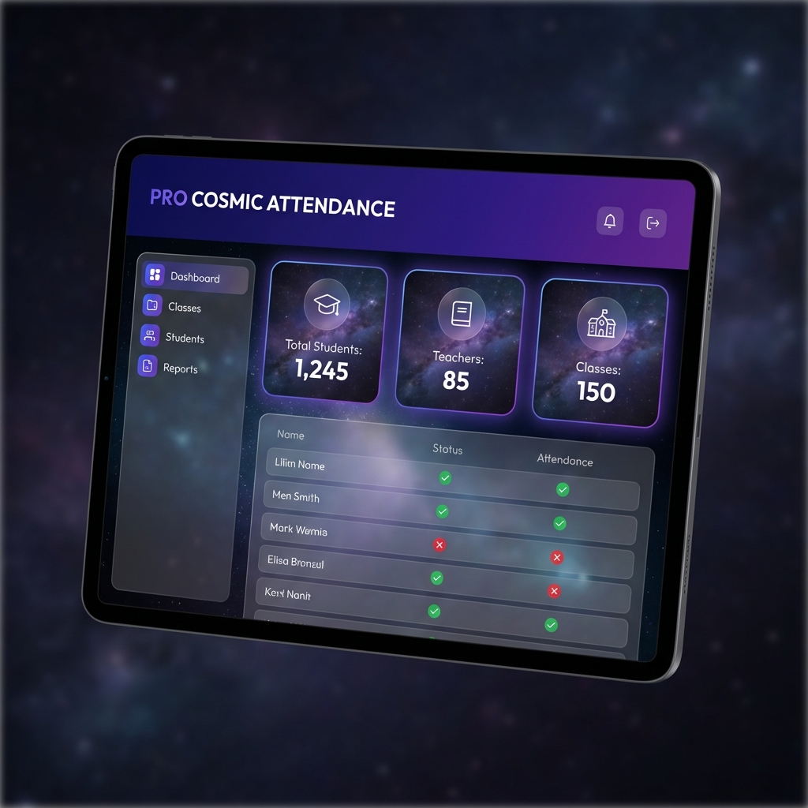
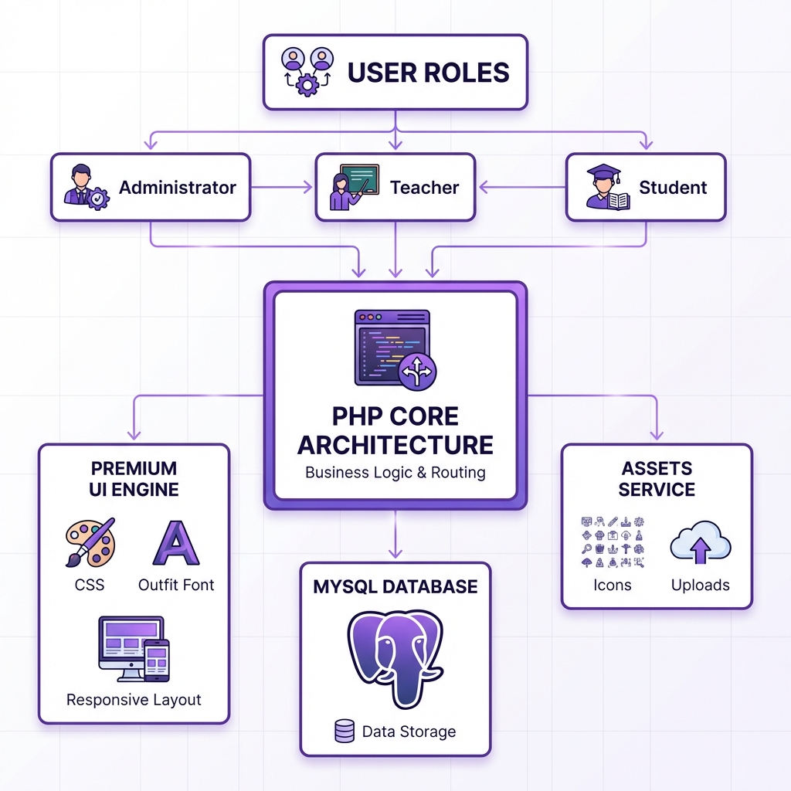

# 🎓 Student Attendance Management System (SAMS) Pro

[]()
[]()
[]()

A high-performance, modern, and aesthetically premium Student Attendance Management System. Built with a focus on speed, user experience, and real-time tracking, SAMS Pro provides a comprehensive solution for educational institutions to manage student records and daily attendance seamlessly.

---

## ✨ Project Preview



---

## 🚀 Key Features

### 🏛️ Administrator Portal
- **Overview Dashboard**: Real-time stats for students, teachers, and classes.
- **User Management**: Create and manage Class Teachers and Student accounts.
- **Academic Setup**: Configure Sessions, Semesters, Classes, and Divisions.
- **Security**: Granular access control and password management.

### 👨‍🏫 Class Teacher Portal
- **Subject Tracking**: Manage attendance for specific assigned subjects.
- **Smart Filters**: Filter and search student data effortlessly.
- **Record Entry**: Take daily attendance with a clean, responsive UI.
- **Reports**: View overall and subject-wise attendance history.

### 🎓 Student Portal
- **Personalized Dashboard**: Track individual academic progress.
- **Attendance Insights**: View overall percentage and subject-specific reports.
- **QR Identity**: Access a digital "Identity Pass" for scanned verification.
- **Pro Profile**: Interactive profile card showing personal academic metadata.

---

## 🏗️ System Working Flow

The application follows a highly decoupled and performant workflow to ensure sub-second response times and 100% data durability.



### Architecture Highlights:
- **User Roles Strategy**: Segregated access for Administrators, Teachers, and Students via professional session management.
- **PHP Core Logic**: A robust procedural backend handling all business logic, routing, and dynamic data processing.
- **Premium UI Engine**: A sophisticated design system using custom CSS tokens, 'Outfit' typography, and a fully responsive grid system.
- **MySQL Persistence**: Optimized database schemas for high-speed attendance logs and relational integrity.

---

## 🛠️ Installation & Setup

### Prerequisites
- Web Server (XAMPP, WAMP, or MAMP)
- PHP 7.4+
- MySQL Database

### Step-by-Step Installation
1. **Clone the Project**:
   ```bash
   git clone https://github.com/mallikarjun-athani/Student-Attendance-Management-System.git
   ```
2. **Setup Database**:
   - Open **phpMyAdmin**.
   - Create a new database named `attendancemsystem`.
   - Import the SQL file from the `DATABASE FILE` directory.
3. **Configure Connection**:
   - Update `Includes/dbcon.php` with your local database credentials.
4. **Run**:
   - Host the folder in your `htdocs` directory and navigate to `http://localhost/Student-Attendance-Management-System/`

---

## 🔐 Default Credentials

| Role | Username | Password |
| :--- | :--- | :--- |
| **Admin** | `admin@mail.com` | `password` |
| **Teacher** | `teacher@mail.com` | `password` |

*(Note: Passwords are MD5 hashed in the database)*

---

## 🎨 Design Aesthetics
SAMS Pro utilizes a **"Pro Cosmic"** design system featuring:
- **Gradient Headers**: Vibrant Indigo & Violet themes.
- **Outfit Typography**: Modern and readable geometric font.
- **Micro-Animations**: Smooth transitions for an interactive feel.
- **Mobile First**: Fully responsive tables and forms optimized for all devices.

---

Developed with ❤️ and focus on Excellence.
